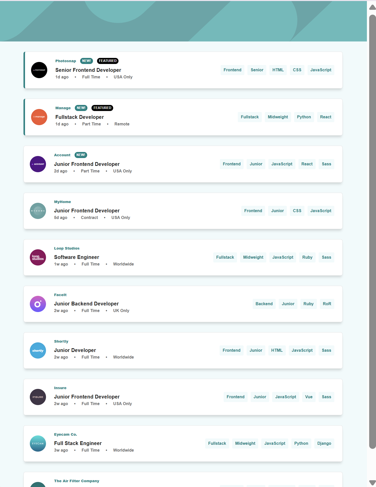
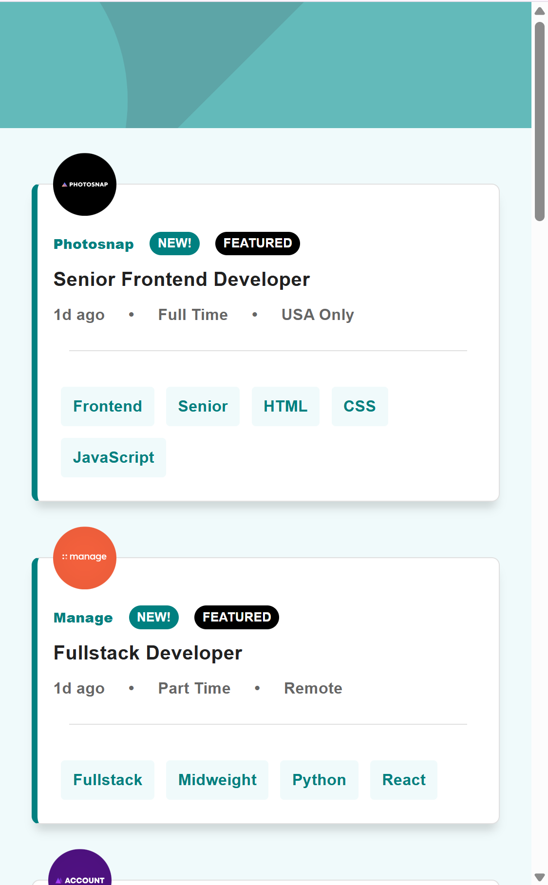
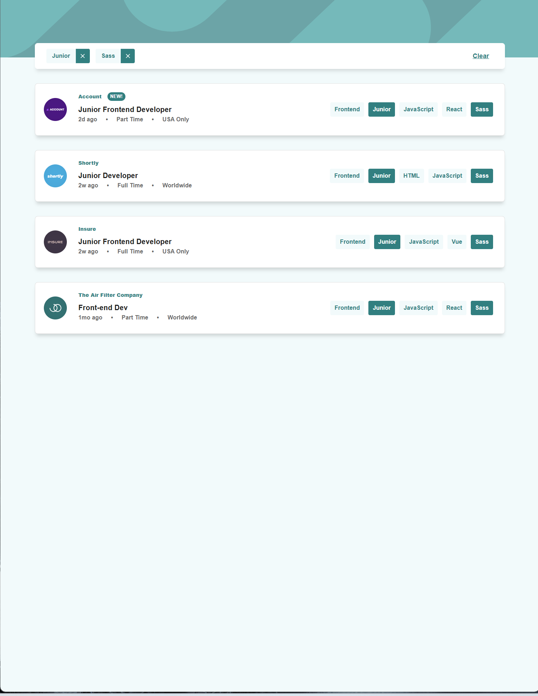
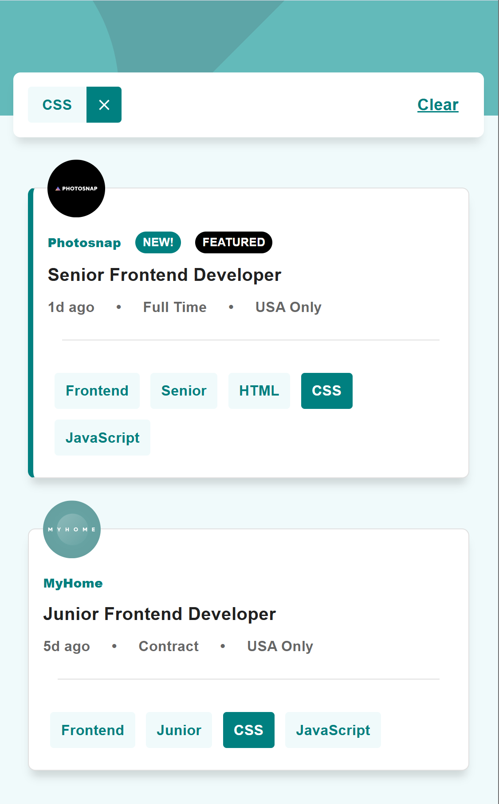

# Job Portal App

A modern, responsive React application for browsing and filtering job listings by skill, level, role, and tools. Built with React and Material UI. Inspired by the Frontend Mentor challenge.

---

## ✨ Demo




---

## 🚀 Features

- Clean, modern, fully responsive design
- **Dynamic filtering:** Click tags to filter jobs (matches all selected tags simultaneously)
- Interactive filter bar “floats” above the job list, with animated chips and clear/remove functions
- Visual highlights for active filters and job tags
- Mobile and desktop layouts
- Built with React and Material-UI

---

## 🛠️ Getting Started

1. **Clone the repo:**
    ```bash
    git clone https://github.com/yourusername/job-listings-filter-app.git
    cd job-listings-filter-app
    ```

2. **Install dependencies:**
    ```bash
    npm install
    ```

3. **Start the development server:**
    ```bash
    npm start
    ```
    App will run at [http://localhost:3000](http://localhost:3000)

---

## 📸 Screenshots

### Desktop




### Mobile




---

## 📁 Project Structure

- `src/components/`: React components (`Header`, `FilterBar`, `JobCard`, etc)
- `src/data.json`: Job listings data
- `src/App.js`: Main application logic & state
- `src/App.css`: Custom styles

---

## 🔎 Key Learnings

- Advanced state and props management in React
- Implementing “AND logic” for multi-tag filters
- Responsive layout & modern UI styling with MUI
- Handling tricky UI edge cases (avatar backgrounds, overflow, etc)

---

## 🚧 Future Improvements

- Accessibility enhancements for a more inclusive UI
- Persist selected filters with LocalStorage
- Pagination or infinite scroll for large job lists
- Modal or detailed view for each job listing
- Animated transitions for filter changes
- Support for additional filters (company, date, remote, etc)
- Dark mode and custom themes
- API integration for live data
- Automated tests for reliability
- User accounts or bookmark/saved job functionality

---

## 💡 Credits

- [Frontend Mentor Challenge](https://www.frontendmentor.io/challenges) for the original job listings inspiration
- [Material UI](https://mui.com/) for React components

---

## 📃 License

[MIT](LICENSE)

---